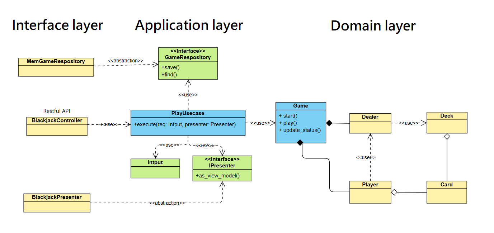

# Blackjack (21 點)

## 專案簡介
這是一個基於 FastAPI 的 21 點 (Blackjack) 遊戲後端實作，支援多人遊戲並透過 Server-Sent Events (SSE) 即時更新玩家狀態。

## 遊戲規則
- A (Ace) 可視為 1 或 11 點。
- J、Q、K 以及 10 均計為 10 點。
- 玩家需確保點數總和不超過 21 點，且高於莊家點數即獲勝。
- 遊戲至少需要 4 名玩家才能開始。

## 技術架構
- **語言**: Python
- **框架**: FastAPI（異步開發）
- **即時更新**: 使用 Server-Sent Events (SSE) 通知玩家狀態變化
- **套件管理**: 使用 Poetry 進行依賴管理

## 系統架構
本專案採用三層式架構 (Interface, Application, Domain)，將不同的功能與邏輯分開，提升專案的可維護性、可測試性與擴展性。

- **Interface layer**：負責與外部進行交互，不包含任何業務邏輯。
  - **API 端點**: 使用 FastAPI 來實現遊戲相關的 API 端點，處理遊戲的創建、玩家加入、遊戲狀態更新等功能。
  - **Game Repository**: `Interface layer` 中包含 `Game Repository`，用於遊戲資料的存取與管理。該 Repository 採用抽象層設計，支援不同的資料庫後端。目前專案使用 In-Memory 儲存，但未來可輕鬆擴展至 MongoDB、PostgreSQL 等資料庫，提供更大的靈活性與可擴展性。

- **Application layer**：負責執行具體的業務邏輯和應用邏輯，例如處理遊戲創建、加入玩家、進行回合等操作。該層邏輯依賴於 Interface 層提供的輸入，並將處理結果交給 Domain 層。

- **Domain layer**：封裝遊戲的核心邏輯，專注於實現計算點數、判斷勝負等功能。該層與外部無關，只依賴 Application 層提供的數據，為遊戲邏輯的核心。




## 安裝與執行方式
使用 poetry 管理 python package
### 1. 安裝專案依賴
```sh
poetry config virtualenvs.in-project true
poetry install
```

### 2. 啟動伺服器
```sh
poetry run python run.py
```

## API 端點 (簡要)
| 方法 | 路徑 | 描述 |
|------|-----------------------------------|------------------|
| POST | `/api/v1/game/create` | 創建新遊戲 |
| POST | `/api/v1/game/{game_id}/join/{player_id}` | 玩家加入遊戲 |
| POST | `/api/v1/game/{game_id}/start` | 開始遊戲 |
| POST | `/api/v1/game/{game_id}/{player_id}/play/hit` | 玩家要牌 |
| POST | `/api/v1/game/{game_id}/{player_id}/play/stand` | 玩家停牌 |
| GET  | `/api/v1/game/{game_id}/{player_id}/status` | 透過 SSE 訂閱遊戲狀態 |

## CLI 客戶端使用方式
本專案提供 Python CLI，玩家可透過終端執行遊戲，指令如下：

### 1. 啟動 CLI
```sh
python client.py
```

### 2. 遊戲流程
1. **房主創建遊戲**:
- 輸入 `create` 創建新遊戲，獲得 `Game ID`。
- 其他玩家可透過 `join` 指令輸入 `Game ID` 和 `Player ID` 加入遊戲。
2. **玩家加入遊戲**:
- 玩家輸入 `join`，並提供 `Game ID` 和 `Player ID` 來加入遊戲。
- 成功加入後，會收到即時遊戲狀態更新。
3. **開始遊戲**:
- 房主輸入 `start` 開始遊戲。
4. **進行遊戲**:
- 玩家可輸入 `hit` 要牌，或 `stand` 停牌。
5. **查看遊戲狀態**:
- 遊戲狀態會透過 SSE 即時更新，並顯示目前的玩家手牌與結果。

## 專案亮點
- **異步開發**: 採用 FastAPI 的 `async` 支援高效能請求處理。
- **即時通訊**: 透過 SSE 提供即時遊戲狀態更新，避免 polling。

